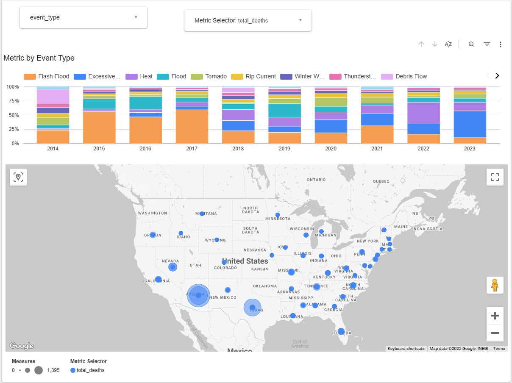

# Severe Storm Events Data Engineering Project

## Table of Contents
- [Overview](#overview)
- [Key Features](#key-features)
- [Problem & Solution](#problem--solution)
- [Deployment Architecture](#deployment-architecture)
- [Deployment Guide](#deployment-guide)
- [Running The Pipeine](#running-the-pipeline)
- [Dashboard Visualization](#dashboard-visualization)
- [Summary](#summary)
- [Project Teardown](#project-teardown)
- [Considerations](#considerations)

---

## Overview

This project is part of the DataTalksClub [Data Engineering Zoomcamp](https://github.com/DataTalksClub/data-engineering-zoomcamp) and focuses on building an end-to-end data pipeline using the NOAA Severe Storm Events dataset.

NOAA’s dataset documents significant weather events across the U.S., including tornadoes, hail, and thunderstorms. It includes metadata about the event, affected location, damages, injuries, and deaths. This project builds a cloud-native pipeline to transform, store, and visualize the data in a structured and scalable way.

---

## Key Features

- **Cloud Native**: Entire pipeline runs on Google Cloud Platform (GCP)
- **Orchestrated Workflows**: Built using [Kestra](https://kestra.io) with parameterized DAGs
- **Infrastructure as Code**: Provisioned and managed via Terraform
- **Efficient Storage**: BigQuery tables are partitioned and clustered for query optimization
- **Modular Transformations**: Implemented with dbt using clear staging and fact layers
- **Interactive Dashboards**: Built with Looker Studio, enabling exploratory data analysis

---

## Problem & Solution

### Challenges

- NOAA storm data is distributed across annual tables
- NOAA codes are unintuitive
- The dataset is large and inefficient to query without optimization
- Transformations need to be modular, testable, and maintainable
- Dashboards require cleaned and analytical data to easily gain insights

### Solution

This project builds a modern pipeline that solves those issues by:
- Extracting and staging raw storm data from BigQuery public datasets
- Exporting the data to Cloud Storage and merging into a central fact table
- Transforming the data with dbt to standardize and clean for analysis
- Orchestrating the full ELT workflow with Kestra
- Visualizing results in Looker Studio with maps and trend charts

---

## Deployment Architecture

The project uses the following technologies:

- **Kestra**: Manages workflow execution with DAGs
- **Terraform**: Provisions GCP services and manages Docker containers
- **BigQuery**: Stores raw, staged, and transformed data
- **Cloud Storage**: Temporarily holds exported CSVs
- **dbt**: Handles SQL-based transformations
- **Docker Compose**: Runs local services like Kestra and PostgreSQL
- **Looker Studio**: Consumes clean data models to power dashboards

The flow looks like this:

```
BigQuery (raw data)
   ↓
Export to GCS (CSV)
   ↓
Load into Central Table (BigQuery)
   ↓
dbt Transformations (clean and model)
   ↓
Looker Studio Dashboard
```


## Deployment Guide

### Prerequisites

Before starting, make sure you have:

- A Google Cloud Platform (GCP) project
- Enabled the BigQuery and Cloud Storage APIs
- A service account with these roles:
  - BigQuery Admin  
  - Storage Admin  
  - Compute Admin  
- Installed on your machine:
  - **Git**
  - **Docker**
  - **Terraform**

### Setup

```bash
# Step 1: Clone this project
git clone https://github.com/gchoong/SevereStorms.git
cd SevereStorms/

# Step 2: Add your GCP credentials
# Name your service account key: my_creds.json
# Put it in the root folder AND the /terraform folder

# Step 3: Create env_encoded folder
mkdir .env_encoded

# Step 4: Run env_script.sh to encode your credentials for Kestra
bash env_script.sh

# Step 5: Start local services
docker compose up --build
```

# Running the Pipeline
### 1. Access Kestra

Open your browser and go to:  
**http://localhost:8080**

### 2. Add Kestra Workflows

Copy-paste these YAML files into new flows in the Kestra UI:

- `kv_script.yml`
- `noaa_storm_to_gcs.yml`
- `transform_noaa_dbt.yml`

### 3. Run the Workflows

1. **Run `export-noaa-storms-to-gcs`**  as backfill
   - I ran the past 10 years from 2024. (2025 is not available)
   - (Older years available from 1950 onwards — but may cost credits)

2. **Run `transform-noaa-dbt`**  
   - This will clean and structure your data for analysis

# Dashboard Visualization

The final dashboard, built in [**Looker Studio**](https://lookerstudio.google.com/s/qotLhE77CmI), provides a fully interactive experience for exploring the impact of severe storms across the United States. Users can explore, filter, and compare storm events using a variety of dynamic charts and controls.

### Key Features

- **Dynamic Metric Switching**  
  Easily toggle between key metrics — including *total injuries, total deaths, property damage, crop damage, total damage*, and *storm magnitude* — using a single dropdown selector. All visualizations update automatically based on the selected metric.

- **Interactive Bubble Map**  
  View storm events geographically using a Google Maps chart, with bubble size and color driven by the selected metric. Tooltips dynamically reflect the metric value and label, helping users immediately understand the impact.

- **Bar Charts**  
  Compare storm types by total injuries, fatalities, or damage. Charts automatically reflect the selected metric for side-by-side comparison of event categories.

https://lookerstudio.google.com/s/qotLhE77CmI




# Summary

This project demonstrates key data engineering capabilities:

- ✅ Fully cloud-native stack 
- ✅ Infrastructure as Code via Terraform
- ✅ Partitioned and clustered warehouse tables for performance
- ✅ Reproducible, modular dbt transformations
- ✅ Workflow orchestration via Kestra
- ✅ Interactive, multi-tile dashboard in Looker Studio

The result is a scalable, production-ready pipeline that transforms public storm data into insights for exploration, research, and public awareness.

# Project Teardown

You will need to first need to run

```docker-compose run --entrypoint "sh" terraform```

then run ```terraform destroy```. 

now you can run 

```docker compose down```

# Considerations

## Partitioning and Clustering 

The BigQuery tables are partitioned by ```event_begin_time``` and clustered by ```event_type```, ```state```, and ```event_year```. This design was chosen to support common access patterns — such as filtering by time, storm type, and location — while minimizing query cost and maximizing performance for interactive analytics.

## Transformations
Found within the dbt/models/core filepath

