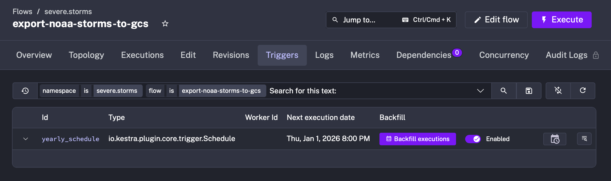
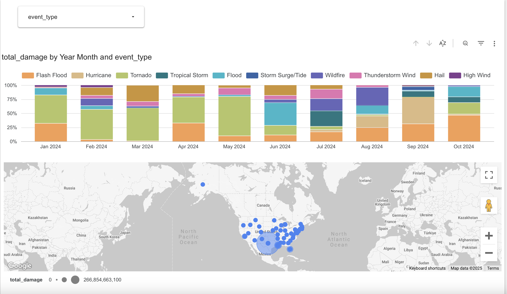

# Severe Storm Events Data Engineering Project

## Table of Contents
- [Overview](#overview)
- [Key Features](#key-features)
- [Problem & Solution](#problem--solution)
- [Deployment Architecture](#deployment-architecture)
- [Deployment Guide](#deployment-guide)
- [Running The Pipeine](#running-the-pipeline)
- [Dashboard Visualization](#dashboard-visualization)
- [Summary](#summary)
- [Considerations](#considerations)

---

## Overview

This project is part of the DataTalksClub [Data Engineering Zoomcamp](https://github.com/DataTalksClub/data-engineering-zoomcamp) and focuses on building an end-to-end data pipeline using the NOAA Severe Storm Events dataset.

NOAA’s dataset documents significant weather events across the U.S., including tornadoes, hail, and thunderstorms. It includes metadata about the event, affected location, damages, injuries, and deaths. This project builds a cloud-native pipeline to transform, store, and visualize the data in a structured and scalable way.

---

## Key Features

- **Cloud Native**: Entire pipeline runs on Google Cloud Platform (GCP)
- **Orchestrated Workflows**: Built using [Kestra](https://kestra.io) with parameterized DAGs
- **Infrastructure as Code**: Provisioned and managed via Terraform
- **Efficient Storage**: BigQuery tables are partitioned and clustered for query optimization
- **Modular Transformations**: Implemented with dbt using clear staging and fact layers
- **Interactive Dashboards**: Built with Looker Studio, enabling exploratory data analysis

---

## Problem & Solution

### Challenges

- NOAA storm data is distributed across annual tables
- The dataset is large and inefficient to query without optimization
- Transformations need to be modular, testable, and maintainable
- Dashboards require cleaned and analytical data models due to non-intuitive federal codes

### Solution

This project builds a modern pipeline that solves those issues by:
- Extracting and staging raw storm data from BigQuery public datasets
- Exporting the data to Cloud Storage and merging into a central fact table
- Transforming the data with dbt to standardize and clean for analysis
- Orchestrating the full ETL workflow with Kestra
- Visualizing results in Looker Studio with maps and trend charts

---

## Deployment Architecture

The project uses the following technologies:

- **Kestra**: Manages workflow execution with DAGs
- **Terraform**: Provisions GCP services and manages Docker containers
- **BigQuery**: Stores raw, staged, and transformed data
- **Cloud Storage**: Temporarily holds exported CSVs
- **dbt**: Handles SQL-based transformations
- **Docker Compose**: Runs local services like Kestra and PostgreSQL
- **Looker Studio**: Consumes clean data models to power dashboards

The flow looks like this:

1. Extract storm data from BigQuery
2. Write to a temp table and export to GCS
3. Merge into a centralized fact table in BigQuery
4. Run dbt transformations
5. Visualize in Looker Studio

---

## Deployment Guide

### Prerequisites

- A Google Cloud Platform project
- BigQuery and Cloud Storage enabled
- A service account with permissions: BigQuery Admin, Storage Admin
- Docker, Git, and Terraform installed locally

### Setup

```bash
# Clone the repo
git clone https://github.com/gchoong/SevereStorms.git
cd SevereStorms/

# get your service account key, name it my_creds.json then put into root and /terraform folder

# For simplicity sake, we will use one service account for kestra, terraform, and dbt.

#create env_encoded file

mkdir .env_encoded

#run the env_script.sh in bash to get your key which will go into the env_encoded

# Build and start containers
docker compose up --build

```

# Running the Pipeline
Open Kestra UI: http://localhost:8080

Copy and paste the following .yml files and create them in Kestra

- kv_script.yml
- noaa_storm_to_gcs.yml
- transform_noaa_dbt.yml

Run the flow export-noaa-storms-to-gcs via backfill execution. One year should be fine. 



Run the flow transform-noaa-dbt to execute dbt transformations

Access and analyze the results in BigQuery or Looker Studio

# Dashboard Visualization

The final dashboard, built in Looker Studio, includes:

Map charts showing storm impact by location (total damage, fatalities)
Bar charts comparing storm types by injuries or cost
Time series trends for fatalities and damage over the years
Interactive filters to drill down by event type, state, or year

https://lookerstudio.google.com/s/j3MpOYLqOJ4




# Summary

This project demonstrates key data engineering capabilities:

- ✅ Fully cloud-native stack 
- ✅ Infrastructure as Code via Terraform
- ✅ Partitioned and clustered warehouse tables for performance
- ✅ Reproducible, modular dbt transformations
- ✅ Workflow orchestration via Kestra
- ✅ Interactive, multi-tile dashboard in Looker Studio

The result is a scalable, production-ready pipeline that transforms public storm data into insights for exploration, research, and public awareness.

# Considerations

## Partitioning and Clustering 

The BigQuery tables are partitioned by ```event_begin_time``` and clustered by ```event_type```, ```state```, and ```event_year```. This design was chosen to support common access patterns — such as filtering by time, storm type, and location — while minimizing query cost and maximizing performance for interactive analytics.

## Transformations
Found within the dbt/models/core filepath

# Notes
if wanting to close terraform without closing docker 

docker-compose run --entrypoint "sh" terraform

then run terraform destroy. 
